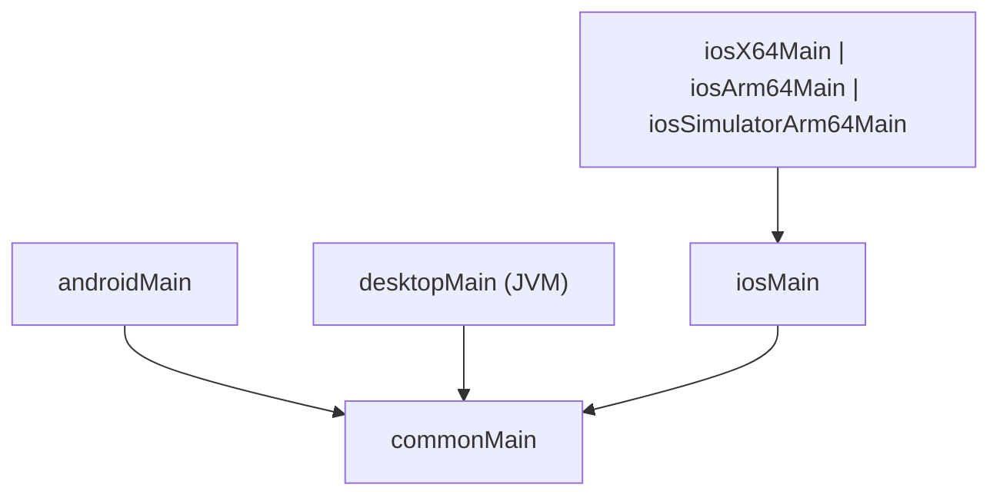
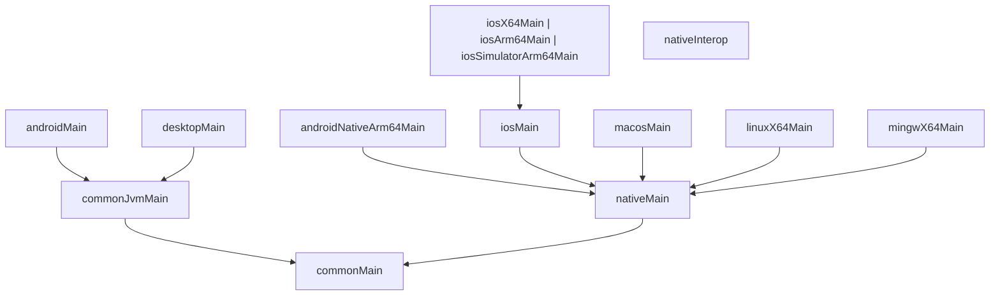

# Llama Compose - Colombia AI Week 2025 Showcase
 

> Re-inventing the wheel with style
 
## Overview

Llama Compose is a Kotlin Multiplatform (KMP) application showcasing private, on-device LLM inference with llama.cpp, an agent with tool calling, and a modern Compose Multiplatform UI.

It targets Android, iOS, Desktop via shared code with platform-specific integrations.

It is the topic of my talk on Colombia AI Week 2025.

## Table of Contents
- [Overview](#overview)
- [Highlights](#highlights)
- [Download](#download-)
- [Quick Start](#quick-start)
  - [Prerequisites](#prerequisites)
  - [Clone & Initialize](#clone--initialize)
  - [Models](#models)
  - [Run (Android)](#run-android)
  - [Run (iOS)](#run-ios)
  - [Run (Desktop)](#run-desktop)
- [Project Structure (single repo)](#project-structure-single-repo)
  - [Source Set Hierarchy (composeApp)](#source-set-hierarchy-composeapp)
  - [Source Set Hierarchy (llama)](#source-set-hierarchy-llama)
- [Platform Notes](#platform-notes)
  - [macOS](#macos)
  - [Windows (MinGW)](#windows-mingw)
  - [Linux](#linux)
- [Vulkan backend patch (optional)](#vulkan-backend-patch-optional)
- [Attributions & Licenses](#attributions--licenses)

## Highlights
- Local LLM inference using [llama.cpp](https://github.com/ggml-org/llama.cpp)
- Agent mode with tool calling (notes, calendar, tasks, contacts, places, time) powered by JetBrains' [Koog.ai](https://github.com/JetBrains/koog)
- Simple chat mode for direct model interaction
- Compose Multiplatform UI, Koin DI, Ktor client

## Download 📦

Llama Compose is available for iOS and macOS.

<div align="center"><a href="https://apps.apple.com/ua/app/llama-compose/id6751783391"></a></div>
<!-- <div align="center"><a href="https://apps.apple.com/TODO"></a></div>
<div align="center"> -->
Google Play coming soon.
<!-- <div align="center"><a href="https://play.google.com/store/apps/details?id=TODO"></a></div> -->

Windows store coming soon.
<!-- <a href="https://apps.microsoft.com/detail/TODO">
	
</a> -->
<!-- </div> -->

## Quick Start

### Prerequisites
- JDK 17+
- Git (with submodules)
- Gradle (wrapper is provided)
- Platform SDKs as needed:
    - Android Studio (SDK/NDK)
    - Xcode (for iOS/macOS)
    - Desktop: Java/Compose runtime (handled by Gradle)
- Recommended tools by platform:
    - macOS: Homebrew, `ninja`, `libomp` (for OpenMP), Metal-capable device for GPU
    - Windows: MSYS2/MinGW toolchain for native builds (see Windows notes)
    - Linux: CMake toolchain; Vulkan SDK for GPU (optional)

### Clone & Initialize
```bash
git clone https://github.com/DmyMi/llama-compose
cd llama-compose
git submodule update --init --recursive
```

### Models
- Use GGUF models compatible with llama.cpp.
- Option 1: Use in-app model download/selection UI.
- Option 2: Modify default model object with your models.
The default models are defined in `composeApp/src/commonMain/kotlin/cloud/dmytrominochkin/ai/llamacompose/download/Models.kt`:

**Available Models:**
- **Llama 3 Groq 8B Tool Use** (4.9 GiB) - Optimized for tool calling and function execution
  - Provider: `bartowski`
  - Hugging Face: [bartowski/Llama-3-Groq-8B-Tool-Use-GGUF](https://huggingface.co/bartowski/Llama-3-Groq-8B-Tool-Use-GGUF)

- **Gemma 3n E4B IT** (4.5 GiB) - Google's 4B parameter instruction-tuned model
  - Provider: `unsloth`
  - Hugging Face: [unsloth/gemma-3n-E4B-it-GGUF](https://huggingface.co/unsloth/gemma-3n-E4B-it-GGUF)

- **Gemma 3n E2B IT** (3.3 GiB) - Lightweight 2B parameter model for mobile/edge
  - Provider: `unsloth`
  - Hugging Face: [unsloth/gemma-3n-E2B-it-GGUF](https://huggingface.co/unsloth/gemma-3n-E2B-it-GGUF)

- **Llama 3.2 3B Instruct** (2.3 GiB) - Meta's compact instruction-tuned model
  - Provider: `unsloth`
  - Hugging Face: [unsloth/Llama-3.2-3B-Instruct-GGUF](https://huggingface.co/unsloth/Llama-3.2-3B-Instruct-GGUF)

- **Llama 3.2 1B Instruct** (0.9 GiB) - Ultra-lightweight 1B parameter model
  - Provider: `unsloth`
  - Hugging Face: [unsloth/Llama-3.2-1B-Instruct-GGUF](https://huggingface.co/unsloth/Llama-3.2-1B-Instruct-GGUF)

- **Gemma 3 270m IT** (0.5 GiB) - Minimal 270M parameter model for testing
  - Provider: `unsloth`
  - Hugging Face: [unsloth/gemma-3-270m-it-GGUF](https://huggingface.co/unsloth/gemma-3-270m-it-GGUF)

All models are quantized GGUF format from Hugging Face, optimized for different use cases from desktop to mobile deployment.

### Run (Android)
- Open in Android Studio and run the `composeApp` Android target.
- Or via CLI:
```bash
./gradlew :composeApp:installDebug
adb shell am start -n cloud.dmytrominochkin.ai.llamacompose.MainActivity
```

> Everything will be handled automatically

### Run (iOS)
- Open `iosApp/` in Xcode and run on simulator/device.

> Everything will be handled automatically

### Run (Desktop)
```bash
./gradlew :composeApp:run
```
- Optional: If native llama.cpp & `llama` subproject needs to be built for desktop, run the provided Gradle tasks first.
To build and copy native libraries for desktop platforms, run:

```bash
./gradlew :composeApp:copyNativeLibrariesToDesktop
```

This task automatically:
- Builds llama.cpp with platform-specific optimizations (Metal for macOS, Vulkan for Linux/Windows)
- Builds the Kotlin/Native fatllama wrapper
- Copies the fatllama shared library and dependencies to `desktopResources/`
- Handles MinGW runtime DLLs on Windows
- Supports both debug and release builds

The task handles all native build dependencies internally, so you only need to run this single command.

> [!IMPORTANT]
> Building for different Desktop platforms requires additional setup, check [Platform Notes](#platform-notes) for details.

## Project Structure (single repo)
```
/composeApp/                # Main KMP app (UI, features, navigation)
  └─ src/
     ├─ commonMain/         # Shared Kotlin code + resources
     ├─ androidMain/        # Android-specific code/resources
     ├─ desktopMain/        # Desktop-specific code
     └─ iosMain/            # iOS-specific code

/llama/                     # KMP integration with llama.cpp
  ├─ src/                   # KMP source sets (commonMain, native, android, ios, jvm, …)
  └─ native/                # Third-party native submodules (llama.cpp, OpenCL, Vulkan)

/iosApp/                     # iOS app wrapper (Swift/SwiftUI)
/buildSrc/                   # Gradle build configuration and plugins
/gradle/                     # Gradle wrapper and version catalogs
build.gradle.kts, settings.gradle.kts, gradle.properties, local.properties
```

### Source Set Hierarchy (composeApp)


### Source Set Hierarchy (llama)


## Platform Notes

### macOS
- Install dependencies (_if you want to enable OpenMP_):
```bash
brew install ninja libomp
```

Metal GPU acceleration is automatically enabled on macOS by default. To configure Metal settings:

```kotlin
// In your build.gradle.kts
llamaCpp {
    desktop {
        enableMetal.set(true)  // Enable Metal GPU acceleration (default: true on macOS)
        enableBlas.set(true)   // Enable BLAS for CPU optimization
        macOsSharedLibs.set(false)  // Build static libraries (default: false)
    }
}
```

Runtime Metal Selection:
- Metal is automatically detected and used when available
- Falls back to CPU/OpenMP if Metal is not available
- Metal library is embedded in the build (`GGML_METAL_EMBED_LIBRARY=ON`)
- Supports both Intel and Apple Silicon architectures

CMake Flags Applied:
- `GGML_METAL=ON` - Enables Metal backend
- `GGML_METAL_EMBED_LIBRARY=ON` - Embeds Metal library
- `CMAKE_OSX_ARCHITECTURES=arm64;x86_64` - Universal binary support

### Windows (MinGW)
1. Install MSYS2 from [msys2.org](https://www.msys2.org/)
2. Launch MSYS2 MINGW64 terminal (blue icon)
3. Install build tools:
```bash
pacman -S mingw-w64-x86_64-gcc mingw-w64-x86_64-cmake
```
4. Set environment variables (replace paths with your actual paths):
```bash
export JAVA_HOME=$(cygpath -u "C:\path\to\jdk\jdk-17")
export GRADLE_USER_HOME=$(cygpath -u "C:\path\to\.gradle")
export KONAN_DATA_DIR=$(cygpath -u "C:\path\to\.konan")
export MINGW64_BIN=$(cygpath -u "C:\msys64\mingw64\bin")
export PATH="$JAVA_HOME/bin:$PATH"
```

Optional GPU acceleration:
- Vulkan: Install [Vulkan SDK](https://vulkan.lunarg.com/sdk/home#windows) and set environment variables (replace paths with your actual paths):
```bash
export VULKAN_SDK=$(cygpath -u "C:\path\to\VulkanSDK\1.4.321.1")
export PATH="$VULKAN_SDK/bin:$PATH"
```
- Install MingW64 Vulkan headers for linker search: `pacman -S mingw-w64-x86_64-vulkan-devel`
- OpenBLAS (optional, need to enable in `build.gradle.kts`): `pacman -S mingw-w64-x86_64-openblas`

### Linux
**Basic setup:**
```bash
# Ubuntu/Debian
sudo apt-get install -y build-essential cmake

# Optional: Vulkan SDK for GPU acceleration
wget -qO - https://packages.lunarg.com/lunarg-signing-key-pub.asc | sudo apt-key add -
sudo wget -qO /etc/apt/sources.list.d/lunarg-vulkan-noble.list https://packages.lunarg.com/vulkan/lunarg-vulkan-noble.list
sudo apt-get update -y
sudo apt-get install -y vulkan-sdk mesa-vulkan-drivers
```

> [!NOTE]
> Vulkan is optional but recommended for GPU acceleration. CPU-only builds work without it.

## Vulkan backend patch (optional)

Following patch needs to be applied for Vulkan if you plan to run on older devices:


Need to change `GGML_ABORT` to error:
```diff
--- a/ggml/src/ggml-vulkan/ggml-vulkan.cpp
+++ b/ggml/src/ggml-vulkan/ggml-vulkan.cpp
@@ -4449,7 +4449,8 @@ static void ggml_vk_instance_init() {
   if (api_version < VK_API_VERSION_1_2) {
       std::cerr << "ggml_vulkan: Error: Vulkan 1.2 required." << std::endl;
-        GGML_ABORT("fatal error");
+        // Do not abort the whole process. Report initialization failure so the backend can be skipped.
+        throw vk::SystemError(vk::Result::eErrorFeatureNotPresent, "Vulkan 1.2 required");
   }
```

And optionally, handle other exceptions:

```diff
--- a/ggml/src/ggml-vulkan/ggml-vulkan.cpp
+++ b/ggml/src/ggml-vulkan/ggml-vulkan.cpp
@@ -12717,7 +12717,14 @@ ggml_backend_reg_t ggml_backend_vk_reg() {
   try {
       ggml_vk_instance_init();
       return &reg;
   } catch (const vk::SystemError& e) {
       VK_LOG_DEBUG("ggml_backend_vk_reg() -> Error: System error: " << e.what());
       return nullptr;
+    } catch (const std::exception &e) {
+        VK_LOG_DEBUG("ggml_backend_vk_reg() -> Error: " << e.what());
+        return nullptr;
+    } catch (...) {
+        VK_LOG_DEBUG("ggml_backend_vk_reg() -> Error: unknown exception during Vulkan init");
+        return nullptr;
   }
}
```

## Attributions & Licenses
- This repository’s license: Apache 2.0
- **llama.cpp** — Copyright respective authors (MIT)
- **Compose Multiplatform** — JetBrains (Apache 2.0)
- **Koog.ai Agents framework** — JetBrains (Apache 2.0)
- **Koin DI** — InsertKoin (Apache 2.0)
- **Ktor Client** — JetBrains (Apache 2.0)
- **Okio** — Square (Apache 2.0)
- **Kotlinx Serialization** — JetBrains (Apache 2.0)
- **Markdown Renderer** — Mike Penz (Apache 2.0)
- **Kottie** — Ismai117 (Apache 2.0)
- **JNA** — Java Native Access (Apache 2.0)
- **DataStore** — AndroidX (Apache 2.0)
- **Wire** — Square (Apache 2.0)
- **Navigation Compose** — AndroidX (Apache 2.0)
- **Logback** — QOS.ch (EPL 1.0)
- **SLF4J** — QOS.ch (MIT)